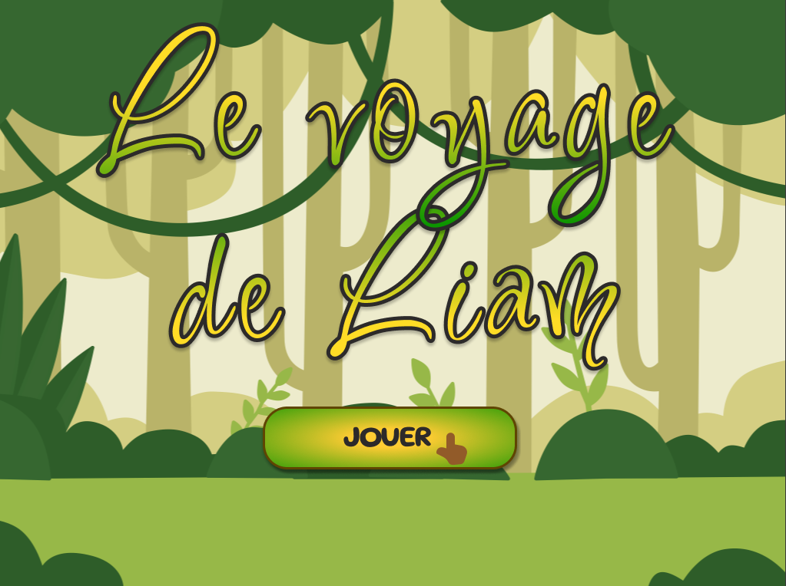
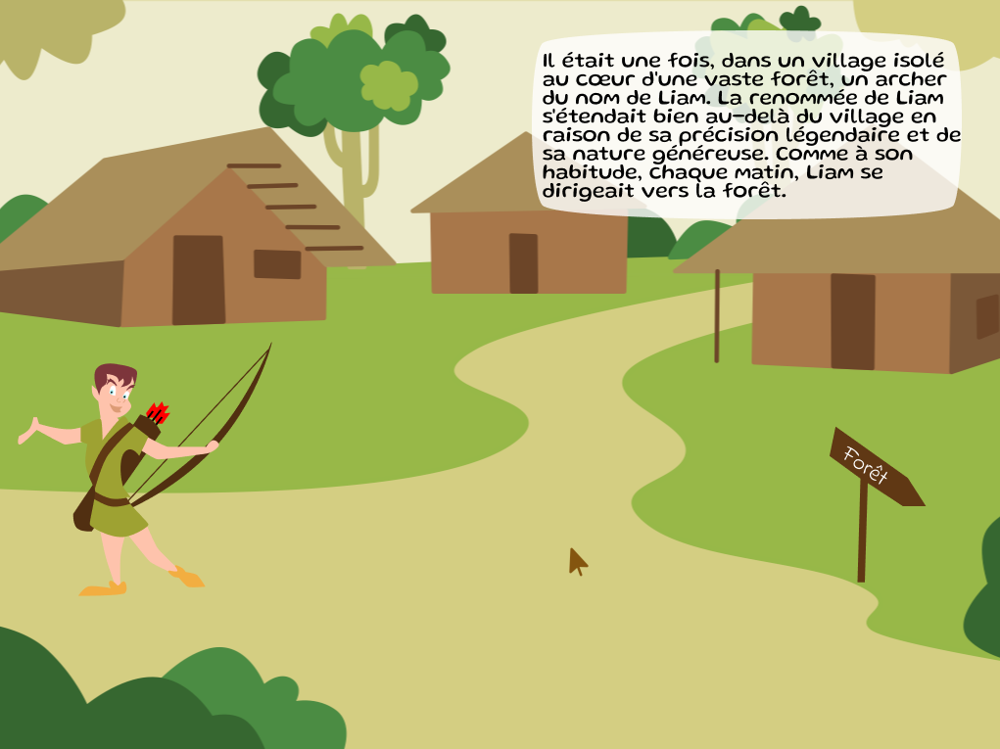
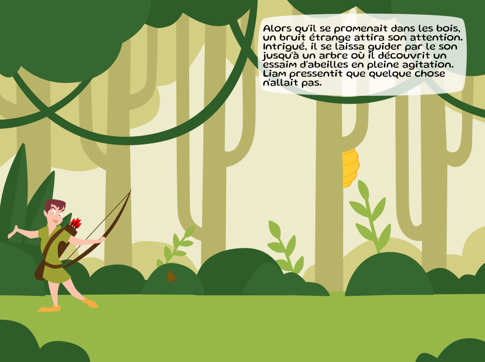
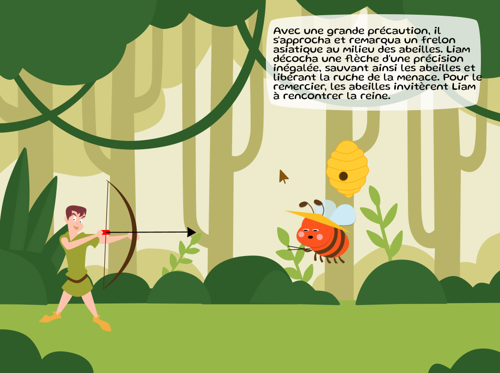
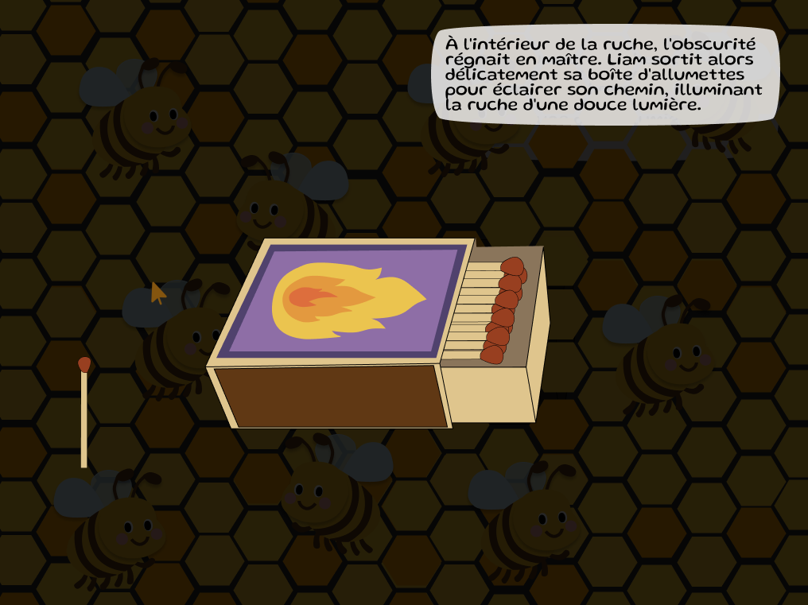
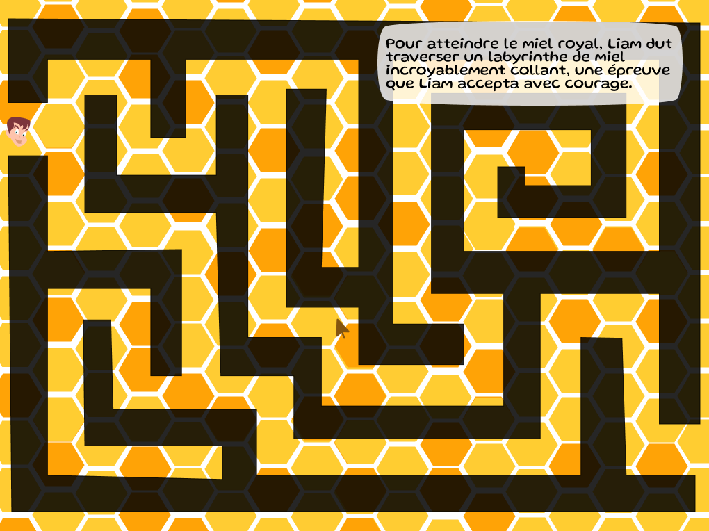
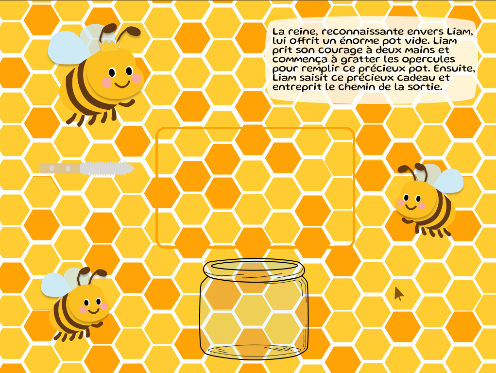
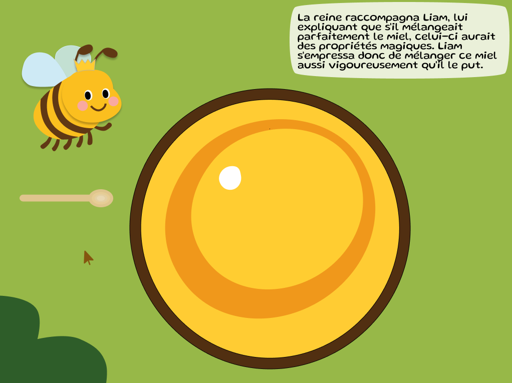
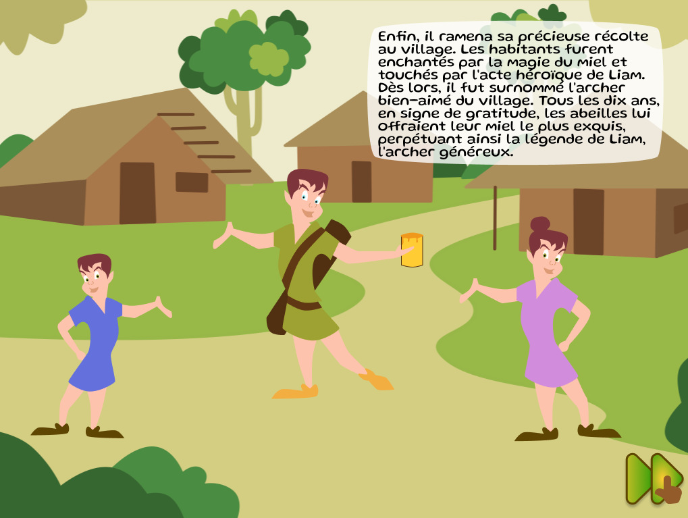
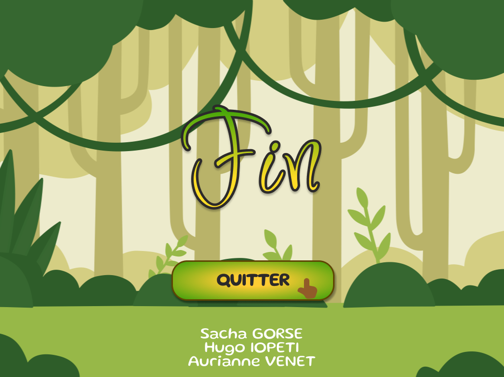

# LiamsJourney

<H3>Présentation</H3>

Projet d'Interfaces haptiques de M2.

Développé en C++ avec Qt.

Par Hugo, Aurianne et Sacha.

---

<H3>Histoire</H3>

Scène 1 : Il était une fois, dans un village isolé au cœur d'une vaste forêt, un archer du nom de Liam. La renommée de Liam s'étendait bien au-delà du village en raison de sa précision légendaire et de sa nature généreuse. Comme à son habitude, chaque matin, Liam se dirigeait vers la forêt.

Scène 2 : Alors qu'il se promenait dans les bois, un bruit étrange attira son attention. Intrigué, il se laissa guider par le son jusqu'à un arbre où il découvrit un essaim d'abeilles en pleine agitation. Liam pressentit que quelque chose n'allait pas.

Scène 3 : Avec une grande précaution, il s'approcha et remarqua un frelon asiatique au milieu des abeilles. Liam décocha une flèche d'une précision inégalée, sauvant ainsi les abeilles et libérant la ruche de la menace. Pour le remercier, les abeilles invitèrent Liam à rencontrer la reine.

Scène 4 : À l'intérieur de la ruche, l'obscurité régnait en maître. Liam sortit alors délicatement sa boîte d'allumettes pour éclairer son chemin, illuminant la ruche d'une douce lumière.

Scène 5 : Pour atteindre le miel royal, Liam dut traverser un labyrinthe de miel incroyablement collant, une épreuve que Liam accepta avec courage.

Scène 6 : La reine, reconnaissante envers Liam, lui offrit un énorme pot vide. Liam prit son courage à deux mains et commença à gratter les opercules pour remplir ce précieux pot. Ensuite, Liam saisit ce précieux cadeau et entreprit le chemin de la sortie.

Scène 7 : La reine raccompagna Liam, lui expliquant que s'il mélangeait parfaitement le miel, celui-ci aurait des propriétés magiques. Liam s'empressa donc de mélanger ce miel aussi vigoureusement qu'il le put.

Fin : Enfin, il ramena sa précieuse récolte au village. Les habitants furent enchantés par la magie du miel et touchés par l'acte héroïque de Liam. Dès lors, il fut surnommé l'archer bien-aimé du village. Tous les dix ans, en signe de gratitude, les abeilles lui offraient leur miel le plus exquis, perpétuant ainsi la légende de Liam, l'archer généreux.

---

<H3>Effets haptiques</H3>

- Scène 1 : Déplacement de Liam sur le chemin de gravier.
- Scène 2 : Vibration des abeilles lorsque Liam se déplace vers la ruche.
- Scène 3 : Liam tire une flèche sur le frelon qui bloque l'entrée de la ruche pour la libérer.
- Scène 4 : Il fait sombre à l'intérieur de la ruche. L'utilisateur doit allumer son allumette en grattant la boite.
- Scène 6 : Les murs du labyrinthe/tunnel sont collants. Le curseur de l'utilisateur a des difficultés pour se décoller du mur.
- Scène 7 : Activer l'effet miel remué.
- Effet BONUS : Gratter pour récupèrer le miel entre scène 6 et scène 7.

---

<H3>Captures d'écran</H3>

